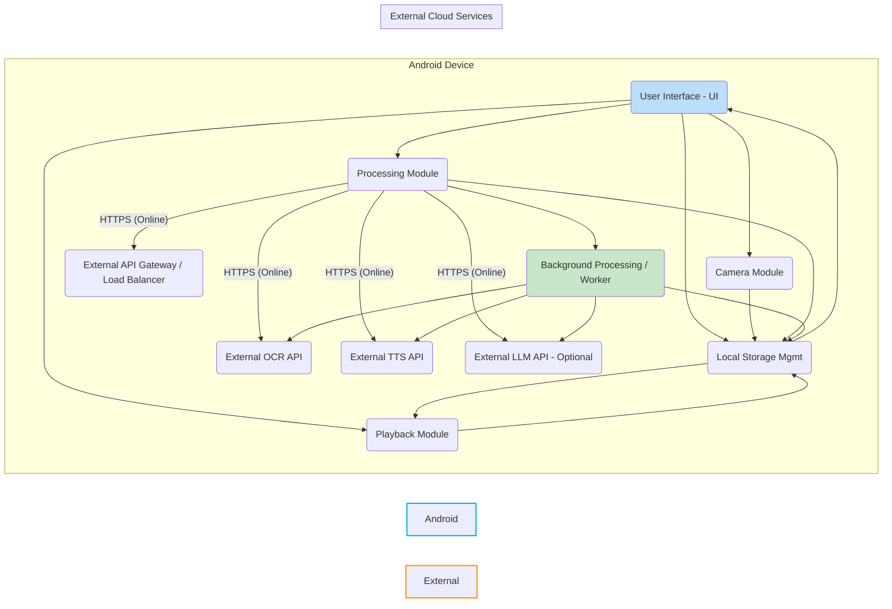

# Projekt Architektury Szczegółowej - Lektor Książek dla Słabowidzących

## 1. Executive Summary

Projekt "Lektor Książek dla Słabowidzących" to aplikacja mobilna na platformę Android, której głównym celem jest umożliwienie osobom ze znacznymi problemami wzrokowymi samodzielnego skanowania stron książek drukowanych i odsłuchiwania ich treści w formie mowy syntetycznej. Aplikacja kładzie silny nacisk na prostotę interfejsu (UI) i dostępność (Accessibility), a także na kluczową możliwość działania offline w trybie skanowania i odczytu. Przetwarzanie zeskanowanych obrazów (OCR, konwersja na mowę) odbywa się online za pomocą zewnętrznych usług chmurowych.

**Kluczowe Decyzje Architektoniczne:**

1. **Architektura Klient-Centric z Procesowaniem w Chmurze (Client-Side Application with Cloud Processing):** Główna logika UI, skanowania offline, zarządzania lokalnymi danymi i odtwarzania audio znajduje się na urządzeniu Android. Obciążające zadania (OCR, TTS) są przekazywane do zewnętrznych API online.
2. **Technologia Natywna Android (Kotlin + Android SDK):** Wybór platformy i technologii natywnej zapewnia pełny dostęp do funkcji systemowych (Kamera, Storage, Accessibility, TTS) i pozwala na optymalne dostosowanie interfejsu do specyficznych potrzeb grupy docelowej.
3. **Zewnętrzne API dla Procesowania:** Wykorzystanie wyspecjalizowanych usług chmurowych dla OCR (np. Google Cloud Vision AI) i TTS (np. Google Cloud Text-to-Speech) pozwala na osiągnięcie wysokiej jakości rozpoznawania i syntezy mowy bez konieczności rozwijania własnych, skomplikowanych modeli i infrastruktury.
4. **Lokalne Przechowywanie Danych:** Wszystkie dane książek (zdjęcia, rozpoznany tekst, audio) są przechowywane *wyłącznie* na urządzeniu użytkownika, co zapewnia prywatność i umożliwia działanie offline po przetworzeniu. Do zarządzania metadanymi i strukturą danych wykorzystana zostanie lekka baza danych SQLite, a dla dużych plików system plików.

**Główne Moduły:**

* **User Interface (UI):** Obsługa interakcji użytkownika, wyświetlanie informacji, nawigacja, implementacja wymagań dostępności.
* **Camera Module:** Zarządzanie aparatem urządzenia, robienie zdjęć stron.
* **Local Storage Management:** Zapis, odczyt i organizacja danych książek (zdjęcia, tekst, audio, metadane) na urządzeniu.
* **Processing Module:** Zarządzanie procesem przetwarzania online, komunikacja z zewnętrznymi API (OCR, TTS), obsługa statusów i błędów. Działa w tle.
* **Playback Module:** Odtwarzanie wygenerowanej mowy (audio) offline, nawigacja i sterowanie odtwarzaniem.

## 2. Architektura Wysokiego Poziomu

System składa się z dwóch głównych części: aplikacji klienckiej działającej na urządzeniu z systemem Android oraz zewnętrznych usług chmurowych dostępnych przez Internet.

**Diagram Architektury Systemu:**



**Opis Głównych Warstw i Komponentów:**

1. **Warstwa Prezentacji (UI):** Komponent **User Interface (UI)** odpowiada za wyświetlanie wszystkich ekranów aplikacji, interakcję z użytkownikiem (dotyk, gesty) oraz prezentację danych (listy książek, ekran skanowania, ekran czytania, postęp). Ta warstwa jest ściśle dostosowana do wymagań dostępności dla słabowidzących (duże elementy, wysoki kontrast).
2. **Warstwa Logiki Biznesowej / Aplikacji:** Komponenty takie jak **Camera Module**, **Processing Module** (zarządzanie procesem, nie sama logika OCR/TTS), **Playback Module** oraz **Local Storage Management** realizują logikę aplikacji. Odpowiadają za koordynację działań, zarządzanie przepływem danych *wewnątrz* aplikacji i interakcję z API systemowymi (kamera, pamięć masowa, TTS/MediaPlayer). **Background Processing / Worker** jest częścią tej warstwy, odpowiedzialną za wykonywanie zadań online w tle, nie blokując UI.
3. **Warstwa Danych:** Komponent **Local Storage Management** wraz z wykorzystywanymi przez niego mechanizmami (SQLite, system plików) stanowi warstwę danych, odpowiedzialną za trwałe przechowywanie wszystkich informacji związanych z książkami na urządzeniu użytkownika.
4. **Zewnętrzne Usługi Chmurowe:** **External OCR API**, **External TTS API**, oraz opcjonalnie **External LLM API** to wyspecjalizowane usługi dostarczane przez zewnętrzne firmy (np. Google Cloud, AWS, Azure). Odpowiadają za ciężkie obliczeniowo zadania: optyczne rozpoznawanie tekstu ze zdjęć i konwersję tekstu na mowę. Komunikacja z nimi odbywa się online.

**Przepływ Danych Między Komponentami:**

* **Skanowanie (Offline):** UI -> Camera Module -> Local Storage Mgmt (zdjęcia są zapisywane). UI aktualizuje widok listy stron w książce.
* **Przetwarzanie (Online, w tle):** Background Processing / Worker (triggerowane przez UI lub automatycznie) czyta zdjęcia z Local Storage Mgmt -> Wysyła zdjęcia do External OCR API -> Odbiera tekst. Background Processing / Worker wysyła tekst do External TTS API -> Odbiera pliki audio. Background Processing / Worker zapisuje tekst i audio do Local Storage Mgmt. Aktualizuje status książki w Local Storage Mgmt. Informuje UI o statusie/ukończeniu.
* **Czytanie (Offline):** UI -> Local Storage Mgmt (czyta metadane, ścieżki plików audio, postęp czytania) -> Playback Module (otrzymuje ścieżki do audio). Playback Module czyta pliki audio z Local Storage Mgmt i odtwarza je. UI komunikuje się z Playback Module w celu sterowania odtwarzaniem (Play/Pause/Stop, nawigacja). Playback Module informuje Local Storage Mgmt o postępie czytania.

**Zewnętrzne Integracje i Dependencies:**

* Aplikacja zależna jest od zewnętrznych API OCR, TTS, (opcjonalnie LLM) do przetwarzania. Komunikacja odbywa się poprzez protokół HTTPS.
* Aplikacja zależna jest od API systemu Android dla funkcji takich jak aparat, pamięć masowa, Text-to-Speech Engine (jeśli używany jest systemowy TTS), MediaPlayer, zarządzanie zadaniami w tle (WorkManager) i funkcji dostępności (Accessibility Services).

## 3. Szczegółowy Opis Modułów

### 3.1. Moduł User Interface (UI)

* **Odpowiedzialności:**
  * Wyświetlanie głównych ekranów aplikacji: ekran główny (lista książek), ekran skanowania, ekran czytania, ekran zarządzania pamięcią.
  * Obsługa interakcji dotykowych (kliknięcia, gesty).
  * Wyświetlanie dużych ikon, przycisków i tekstu.
  * Nawigacja między ekranami (Activities/Fragments).
  * Integracja z wbudowanymi funkcjami dostępności Android (np. TalkBack - opcjonalnie, tryb wysokiego kontrastu - opcjonalnie).
  * Pobieranie danych do wyświetlenia z Local Storage Management.
  * Przekazywanie poleceń do innych modułów (np. "start skanowania" do Camera Module, "start przetwarzania" do Processing Module, "play/pause" do Playback Module).
  * Wyświetlanie statusu przetwarzania i postępu czytania.
* **Interfejsy:**
  * Publiczne metody do inicjalizacji ekranów i obsługi zdarzeń systemowych (Activity/Fragment lifecycle).
  * Listener'y lub observer'y do reagowania na zmiany stanu w innych modułach (np. postęp przetwarzania, zmiana pozycji czytania).
  * Eventy/callbacki do przekazywania akcji użytkownika do logiki biznesowej (np. kliknięcie przycisku "Skanuj").
* **Wewnętrzna Struktura:**
  * Wykorzystanie Android Architecture Components: ViewModel do zarządzania stanem UI i cyklem życia, LiveData/StateFlow do obserwacji zmian danych.
  * Ekran jako kombinacja Activity i/lub Fragmentów.
  * Wykorzystanie ViewGroup'ów i View'ów do budowy layoutu. Preferowane użycie ConstraintLayout lub LinearLayout dla prostoty i wydajności.
  * Stylizacja elementów UI w plikach resources (colors.xml, dimens.xml, styles.xml) z uwzględnieniem motywów dla wysokiego kontrastu.
* **Zależności:**
  * Zależny od Local Storage Management do pobierania danych (listy książek, metadanych).
  * Zależny od Camera Module do uruchomienia skanowania.
  * Zależny od Processing Module do inicjowania przetwarzania i monitorowania statusu.
  * Zależny od Playback Module do sterowania odtwarzaniem i monitorowania postępu.
  * Zależny od Android SDK (UI Toolkit, Lifecycle).

### 3.2. Moduł Camera Module

* **Odpowiedzialności:**
  * Inicjalizacja i konfiguracja aparatu urządzenia.
  * Wyświetlanie podglądu z kamery na ekranie skanowania.
  * Robienie zdjęć o odpowiedniej rozdzielczości dla OCR.
  * Zarządzanie uprawnieniami dostępu do aparatu.
* **Interfejsy:**
  * Metoda `initCamera(previewView: View)` do uruchomienia podglądu.
  * Metoda `takePicture(onPictureTaken: (ByteArray) -> Unit)` do zrobienia zdjęcia i zwrócenia danych binarnych.
  * Metoda `releaseCamera()` do zwolnienia zasobów aparatu.
  * Eventy/callbacki informujące o błędach kamery.
* **Wewnętrzna Struktura:**
  * Wykorzystanie biblioteki Android CameraX dla uproszczenia integracji z aparatem, lub Camera2 API dla większej kontroli (CameraX jest rekomendowane dla prostoty).
  * Klasa/Service do zarządzania cyklem życia kamery, uwzględniając cykl życia Activity/Fragmentu.
  * Implementacja logiki robienia zdjęć i konfiguracji (np. auto-focus, flash).
* **Zależności:**
  * Zależny od Android Camera API (CameraX/Camera2).
  * Współpracuje z UI Module (dostarcza View do podglądu) i Local Storage Management (przekazuje dane zdjęcia do zapisu).

### 3.3. Moduł Local Storage Management

* **Odpowiedzialności:**
  * Zapisywanie zdjęć w systemie plików urządzenia.
  * Zapisywanie rozpoznanego tekstu w systemie plików.
  * Zapisywanie plików audio w systemie plików.
  * Zarządzanie metadanymi książek i stron (tytuł, okładka, status, kolejność stron, postęp czytania) w bazie danych SQLite.
  * Grupuje pliki i metadane związane z konkretną książką.
  * Udostępnianie danych innym modułom (UI do wyświetlenia listy, Processing do pobrania zdjęć, Playback do pobrania audio).
  * Zarządzanie pamięcią (usuwanie książek/danych).
* **Interfejsy:**
  * Metoda `createBook(coverImage: ByteArray): BookId`
  * Metoda `addPage(bookId: BookId, pageImage: ByteArray): PageId`
  * Metoda `saveProcessedData(pageId: PageId, text: String, audioFile: File)`
  * Metoda `getBook(bookId: BookId): Book`
  * Metoda `getPages(bookId: BookId): List<Page>`
  * Metoda `getAudioFile(pageId: PageId): File`
  * Metoda `updateReadingProgress(bookId: BookId, progress: ReadingProgress)`
  * Metoda `getReadingProgress(bookId: BookId): ReadingProgress`
  * Metoda `getAllBooks(): List<Book>`
  * Metoda `deleteBook(bookId: BookId)`
  * Metoda `getStorageUsage(): StorageStats`
  * Eventy/callbacki informujące o zmianach w danych (np. dodana nowa książka, zmieniony status).
* **Wewnętrzna Struktura:**
  * SQLiteDatabaseHelper lub biblioteka abstrakcyjna jak Room Persistence Library (rekomendowane Room dla łatwiejszego zarządzania schematem i operacjami asynchronicznymi).
  * DAO (Data Access Objects) dla operacji na bazie danych (Books, Pages, ReadingProgress entities).
  * Klasy pomocnicze do zarządzania plikami w pamięci wewnętrznej/zewnętrznej urządzenia (np. `FileProvider` do bezpiecznego udostępniania plików).
  * Modele danych (np. `Book` data class, `Page` data class, `ReadingProgress` data class).
* **Zależności:**
  * Zależny od Android Storage API.
  * Zależny od SQLite (lub Room).
  * Współpracuje z UI Module, Camera Module, Processing Module, Playback Module.

### 3.4. Moduł Playback Module

* **Odpowiedzialności:**
  * Odtwarzanie plików audio wygenerowanych przez TTS.
  * Sterowanie odtwarzaniem (Play, Pause, Stop).
  * Nawigacja w ramach treści (przejście do poprzedniej/następnej strony, akapitu, zdania).
  * Regulacja prędkości odtwarzania.
  * Zarządzanie bieżącą pozycją odtwarzania i informowanie o niej (dla zapamiętywania postępu).
  * Opcjonalnie: wykorzystanie wbudowanego Android TTS Engine zamiast lokalnych plików audio (prostsze w MVP, ale wymaga generowania tekstu online). Decyzja zależy od jakości Android TTS vs External API TTS i preferencji. **Przyjęto model z lokalnymi plikami audio generowanymi online jako bardziej elastyczny i niezależny od jakości systemowego TTS.**
* **Interfejsy:**
  * Metoda `loadBook(bookId: BookId)`
  * Metoda `play()`
  * Metoda `pause()`
  * Metoda `stop()`
  * Metoda `seekTo(position: ReadingPosition)` (gdzie ReadingPosition może być index strony/akapitu/zdania)
  * Metoda `setPlaybackSpeed(speed: Float)`
  * Eventy/callbacki: `onPlaybackStarted`, `onPlaybackPaused`, `onPlaybackStopped`, `onPlaybackPositionChanged(position: ReadingPosition)`, `onPlaybackCompleted`.
* **Wewnętrzna Struktura:**
  * Wykorzystanie Android MediaPlayer do odtwarzania lokalnych plików audio.
  * Lub wykorzystanie Android TextToSpeech Engine (jeśli rezygnujemy z lokalnych plików audio na rzecz dynamicznej syntezy tekstu z API online). **Decyzja wymaga dalszej analizy kosztów/złożoności vs jakości.** Przyjęto model z MediaPlayer i lokalnymi plikami audio.
  * Service działający w tle (`MediaBrowserServiceCompat` lub podobny) dla płynnego odtwarzania w tle i integracji z systemowymi kontrolami mediów.
  * Logika zarządzania stanem odtwarzania (która strona/akap/zdanie jest aktualnie czytane).
* **Zależności:**
  * Zależny od Android Media Player API lub Android TextToSpeech API.
  * Zależny od Local Storage Management do pobierania plików audio i zapisywania postępu czytania.
  * Współpracuje z UI Module do odbierania poleceń i wysyłania informacji o stanie odtwarzania.

### 3.5. Moduł Processing Module (Background Processing)

* **Odpowiedzialności:**
  * Koordynacja procesu przetwarzania stron: pobieranie zdjęć, wysyłanie do OCR, odbiór tekstu, wysyłanie tekstu do TTS, odbiór audio, zapis wyników.
  * Obsługa komunikacji z zewnętrznymi API (request/response).
  * Zarządzanie kolejką stron do przetworzenia dla danej książki.
  * Obsługa błędów API (sieciowych, błędów przetwarzania, rate limits).
  * Implementacja retry logic dla tymczasowych błędów.
  * Praca w tle, niezależnie od aktywności UI.
  * Informowanie UI o postępie i statusie przetwarzania.
* **Interfejsy:**
  * Metoda `startProcessing(bookId: BookId)`
  * Metoda `cancelProcessing(bookId: BookId)`
  * Eventy/callbacki: `onProcessingProgress(bookId: BookId, pageCount: Int, totalPages: Int)`, `onProcessingCompleted(bookId: BookId)`, `onProcessingFailed(bookId: BookId, error: ProcessingError)`.
* **Wewnętrzna Struktura:**
  * Wykorzystanie Android WorkManager do zarządzania zadaniami w tle, gwarantując wykonanie nawet po zamknięciu aplikacji lub restarcie urządzenia (zgodnie z polityką systemu).
  * Worker lub CoroutineWorker dla głównej logiki przetwarzania.
  * HTTP Client library (np. Retrofit z OkHttp) do komunikacji z API REST.
  * Mappers do konwersji formatów danych między aplikacją a API (np. JSON request/response body mapping).
  * Logika zarządzania stanem przetwarzania (która strona jest aktualnie przetwarzana, które zostały pomyślnie, które zawiodły).
* **Zależności:**
  * Zależny od Android WorkManager API.
  * Zależny od HTTP Client library (Retrofit/OkHttp).
  * Zależny od External OCR API.
  * Zależny od External TTS API.
  * Zależny (opcjonalnie) od External LLM API.
  * Zależny od Local Storage Management do pobierania danych wejściowych (zdjęć) i zapisywania danych wyjściowych (tekstu, audio).
  * Współpracuje z UI Module (odbiera polecenia, wysyła status).

## 4. Przepływ Danych i Komunikacja

Opis kluczowych przepływów użytkownika w kontekście interakcji modułów i danych.

### 4.1. Przypadek Użycia: Dodawanie Nowej Książki i Skanowanie

1. Użytkownik klika "Nowa Książka" w UI.
2. UI wyświetla ekran skanowania i przekazuje polecenie do Camera Module, aby uruchomił podgląd kamery.
3. UI wyświetla podgląd kamery dostarczony przez Camera Module.
4. Użytkownik klika przycisk "Zrób Zdjęcie" (strona okładki, następnie kolejne strony).
5. UI przekazuje polecenie do Camera Module, aby zrobił zdjęcie.
6. Camera Module robi zdjęcie, pobiera dane obrazu (ByteArray).
7. Camera Module przekazuje dane zdjęcia do UI (lub bezpośrednio do Local Storage Management, jeśli UI tylko triggeruje akcję).
8. UI (lub osobny komponent w Logice Aplikacji) przekazuje dane zdjęcia do Local Storage Management, aby zapisał je jako nową stronę w bieżącej książce (lub jako okładkę). Jeśli to pierwsza strona, Local Storage Management tworzy nową książkę i zwraca jej ID.
9. Local Storage Management zapisuje zdjęcie w systemie plików i aktualizuje metadane książki/strony w SQLite.
10. Local Storage Management informuje UI o zapisaniu strony (np. przez LiveData/callback).
11. UI aktualizuje widok (np. wyświetla miniaturę strony, pokazuje licznik stron).
12. Użytkownik powtarza kroki 4-11 dla każdej strony.
13. Użytkownik klika "Zakończ Skanowanie" w UI.
14. UI aktualizuje status książki na "Zeskanowana" w Local Storage Management i wraca do Ekranu Głównego.

**Komunikacja:** Wewnątrz urządzenia, między modułami. Synchroniczna dla akcji UI i Camera, Asynchroniczna dla zapisu do pamięci (choć dla zdjęć może być początkowo synchroniczna, później optymalizacja). Całość offline.

### 4.2. Przypadek Użycia: Przetwarzanie Książki

1. (Opcja 1: Manualnie) Użytkownik klika "Przetwarzaj" na ekranie głównym lub ekranie szczegółów książki w UI.
2. (Opcja 2: Automatycznie) Background Processing / Worker (triggerowany przez WorkManager po wykryciu połączenia online i nowych zeskanowanych książek) identyfikuje książki do przetworzenia.
3. UI (lub Background Processing / Worker) przekazuje bookId do Processing Module (`startProcessing(bookId)`).
4. Processing Module (działający w tle, np. w ramach WorkManagera) czyta listę zeskanowanych stron dla książki z Local Storage Management.
5. Dla każdej strony w kolejności:
    a.  Processing Module czyta zdjęcie strony z Local Storage Management.
    b.  Processing Module wysyła zdjęcie (HTTPS) do External OCR API.
    c.  External OCR API przetwarza zdjęcie i zwraca tekst.
    d.  Processing Module odbiera tekst.
    e.  (Opcjonalnie: wysyła tekst do LLM API dla analizy struktury/poprawy).
    f.  Processing Module wysyła tekst (HTTPS) do External TTS API.
    g.  External TTS API generuje audio i zwraca plik audio (lub link do pliku).
    h.  Processing Module odbiera plik audio.
    i.  Processing Module zapisuje tekst i audio dla strony w Local Storage Management.
    j.  Processing Module aktualizuje status strony (np. "przetworzona") i postęp przetwarzania książki w Local Storage Management.
    k.  Processing Module informuje UI o postępie.
6. Po przetworzeniu wszystkich stron, Processing Module aktualizuje status książki na "Gotowa do czytania" w Local Storage Management.
7. Processing Module informuje UI o ukończeniu przetwarzania.

**Komunikacja:** Głównie asynchroniczna. Wewnątrz urządzenia między modułami (UI -> Processing, Processing -> Storage, Processing -> UI - status). Na zewnątrz: Processing Module <-> External APIs (HTTPS, asynchroniczne request/response). Wymaga połączenia online.

### 4.3. Przypadek Użycia: Czytanie Książki

1. Użytkownik klika na gotową do czytania książkę na Ekranie Głównym w UI.
2. UI wyświetla ekran szczegółów książki, pobierając dane z Local Storage Management.
3. Użytkownik klika "Czytaj" w UI.
4. UI pobiera ostatnią pozycję czytania dla książki z Local Storage Management.
5. UI przekazuje polecenie do Playback Module, aby uruchomił czytanie od wskazanej pozycji (`loadBook(bookId)`, `play()`, `seekTo(position)`).
6. Playback Module czyta ścieżki plików audio dla odpowiednich stron z Local Storage Management.
7. Playback Module czyta plik audio dla bieżącej strony/akapitu z Local Storage Management i rozpoczyna odtwarzanie za pomocą MediaPlayer.
8. Playback Module okresowo informuje UI o postępie odtwarzania (np. który plik jest odtwarzany, która pozycja w pliku).
9. UI wyświetla postęp czytania, kontrolki (Play/Pause/Stop, nawigacja).
10. Użytkownik klika kontrolki nawigacji/odtwarzania w UI.
11. UI przekazuje polecenia (np. `pause()`, `seekTo(next page)`) do Playback Module.
12. Playback Module wykonuje polecenie. Jeśli nawigacja wymaga zmiany pliku audio, czyta nowy plik z Local Storage Management.
13. Playback Module (lub UI przy pauzie/stopie/zamknięciu) zapisuje bieżącą pozycję czytania w Local Storage Management.

**Komunikacja:** Wewnątrz urządzenia, między modułami (UI <-> Playback, Playback -> Storage). Synchroniczna dla poleceń sterowania, asynchroniczna dla odczytu/zapisu danych. Całość offline.

**Strategie Zarządzania Stanem:**

* **Stan UI:** Zarządzany za pomocą ViewModel i LiveData/StateFlow w ramach Android Architecture Components. UI obserwuje zmiany w ViewModel, który z kolei pobiera dane z Local Storage Management lub otrzymuje statusy z Processing/Playback Module.
* **Stan Danych (Trwały):** Przechowywany w SQLite dla metadanych i struktur (Book, Page, ReadingProgress) oraz w systemie plików dla dużych obiektów (zdjęcia, tekst, audio). Local Storage Management jest odpowiedzialny za spójność tych danych.
* **Stan Procesowania:** Zarządzany przez Processing Module, który śledzi status każdej strony w książce (do przetworzenia, w toku, ukończona, błąd). Statusy te są zapisywane w SQLite (w tabeli Page) i udostępniane UI.
* **Stan Odtwarzania:** Zarządzany przez Playback Module (pamięta aktualnie odtwarzany plik, pozycję w pliku). Bieżąca pozycja czytania (w kontekście struktury książki, np. strona + akapit) jest zapisywana w SQLite przez Local Storage Management.

**Obsługa Błędów i Recovery:**

* **Błędy Systemowe (Kamera, Pamięć):** Obsługa wyjątków, wyświetlanie komunikatów użytkownikowi (potencjalnie głosowych), sugerowanie rozwiązań (np. zwolnij pamięć, sprawdź uprawnienia).
* **Błędy API (Sieć, Przetwarzanie):** Processing Module powinien implementować:
  * Retry logic dla błędów przejściowych (np. błędy sieciowe, timeouty, rate limits).
  * Zapisywanie statusu błędu dla konkretnej strony w Local Storage (np. "przetwarzanie nieudane").
  * Powiadamianie UI o błędach przetwarzania, umożliwiając użytkownikowi (lub opiekunowi) ponowienie próby dla konkretnej strony lub książki.
* **Przerwanie Aplikacji/Urządzenia:** WorkManager zapewnia, że zadania przetwarzania w tle zostaną wznowione po restarcie urządzenia. Playback Module powinien zapamiętywać pozycję czytania przed zatrzymaniem.

## 5. Struktura Danych

Dane przechowywane są lokalnie na urządzeniu w dwóch formach: ustrukturyzowane metadane w bazie SQLite oraz pliki w systemie plików.

**Model Danych (SQLite - Przykład):**

```mermaid
erDiagram
    BOOK {
        TEXT book_id PK
        TEXT title
        TEXT cover_image_path
        TEXT status ENUM("scanned", "processing", "ready", "archived")
        TEXT created_at
        TEXT updated_at
        INT current_page_index
        INT current_paragraph_index
        INT current_word_index
    }
    PAGE {
        TEXT page_id PK
        TEXT book_id FK
        TEXT image_path
        TEXT text_path
        TEXT audio_path
        INT page_number OPTIONAL
        TEXT status ENUM("scanned", "processing", "processed", "error")
        INT order_in_book
    }
    READING_PROGRESS {
        TEXT book_id PK
        INT current_page_index
        INT current_paragraph_index
        INT current_word_index
        INT audio_position_ms
        TEXT updated_at
    }

    BOOK ||--|{ PAGE : "contains"
    BOOK ||--o| READING_PROGRESS : "has_one"
```

* `BOOK`: Tabela główna przechowująca informacje o książkach. `current_page_index`, `current_paragraph_index`, `current_word_index` mogą być przechowywane tutaj dla łatwego dostępu do ostatniej pozycji czytania.
* `PAGE`: Tabela przechowująca informacje o poszczególnych stronach książki. Zawiera ścieżki do plików obrazu, tekstu i audio, numer strony (jeśli rozpoznano) i status przetwarzania. `order_in_book` jest kluczowe do zachowania prawidłowej kolejności.
* `READING_PROGRESS`: Alternatywnie, pozycja czytania może być w osobnej tabeli powiązanej z książką, aby oddzielić status książki od postępu czytania konkretnego użytkownika. W MVP można to umieścić w tabeli `BOOK`.

**Formaty Wymiany Danych:**

* **Obrazy:** JPEG lub PNG. Wybór zależy od preferencji CameraX i kompromisu między jakością a rozmiarem pliku. Wymagane API OCR mogą preferować określone formaty.
* **Tekst:** Po rozpoznaniu przez OCR, tekst może być przechowywany jako zwykły plik `.txt` dla prostoty. Jeśli używany jest LLM lub API OCR zwraca strukturalny format (np. z informacją o paragrafach/liniach), można użyć JSON lub XML do zachowania tej struktury. W MVP wystarczy prosty TXT.
* **Audio:** Pliki MP3 lub WAV generowane przez API TTS. MP3 oferuje lepszą kompresję. Jakość i format zależą od wyboru API TTS i preferencji (np. WaveNet/Neural vs Standard).
* **API Contracts:** Komunikacja z zewnętrznymi API odbywa się za pomocą REST API, używając formatu JSON do wysyłania żądań (np. base64 encoded image) i odbierania odpowiedzi (np. JSON z rozpoznanym tekstem, linkiem do audio lub danymi audio base64).

**Strategie Persystencji Danych:**

* SQLite: Używany do przechowywania ustrukturyzowanych metadanych. Operacje na bazie danych powinny być wykonywane asynchronicznie (np. za pomocą coroutines w Room DB), aby nie blokować głównego wątku UI.
* System Plików: Używany do przechowywania dużych plików binarnych (zdjęcia, audio) i tekstu. Ścieżki do tych plików są przechowywane w bazie SQLite. Należy rozważyć użycie pamięci wewnętrznej (`Context.getFilesDir()`) lub zewnętrznej (`Context.getExternalFilesDir()`) w zależności od potrzeb i zarządzania uprawnieniami. Pamięć wewnętrzna jest bezpieczniejsza i nie wymaga specjalnych uprawnień dostępu poza aplikacją.

**Migracje i Wersjonowanie Danych:**

* W przypadku zmian w schemacie bazy danych SQLite w przyszłości, konieczne będzie zaimplementowanie migracji bazy danych (np. za pomocą mechanizmów dostarczonych przez Room). W MVP schemat będzie prosty.
* Zmiany w formacie przechowywania plików (np. zmiana formatu audio) w przyszłości mogą wymagać konwersji istniejących danych lub obsługi wielu formatów.

## 6. Bezpieczeństwo i Prywatność

* **Model Autoryzacji i Autentyfikacji:** W MVP i zgodnie z wymaganiami, aplikacja **nie** wymaga uwierzytelniania ani autoryzacji użytkowników. Dane są dostępne dla każdego użytkownika urządzenia.
* **Ochrona Danych Wrażliwych:** Treść skanowanych książek jest przechowywana lokalnie na urządzeniu. W MVP nie przewiduje się szyfrowania danych "at rest" (na dysku urządzenia). Zakłada się, że fizyczny dostęp do urządzenia jest już chroniony przez mechanizmy systemu Android (blokada ekranu itp.). W przypadku wyższych wymagań bezpieczeństwa, można rozważyć szyfrowanie plików lub bazy danych, ale zwiększa to złożoność i może wpływać na wydajność.
* **Bezpieczna Komunikacja z Zewnętrznymi API:** Cała komunikacja z zewnętrznymi usługami chmurowymi (OCR, TTS, LLM) musi odbywać się za pomocą protokołu HTTPS, aby chronić dane w transporcie.
* **Zarządzanie Kluczami API:** Klucze dostępowe do zewnętrznych API są danymi wrażliwymi. Umieszczanie ich bezpośrednio w kodzie lub plikach konfiguracyjnych aplikacji klienckiej nie jest idealne, ponieważ mogą zostać wydobyte (np. przez inżynierię wsteczną APK). Lepsze praktyki obejmują przechowywanie kluczy w plikach Gradle (nie w repozytorium kodu), szyfrowanie ich w aplikacji i odszyfrowywanie w runtime (zwiększa złożoność) lub użycie pośredniego, własnego backendu proxy (zwiększa złożoność i koszty infrastruktury). **Dla MVP, klucze prawdopodobnie będą przechowywane w sposób minimalizujący ryzyko wycieku podczas developmentu (np. w `local.properties` Git-ignorowane), świadomi ograniczeń bezpieczeństwa aplikacji klienckiej w tym zakresie.**
* **Compliance z Regulacjami:** Należy zweryfikować politykę prywatności i warunki korzystania z wybranych API (Google, AWS, Azure) pod kątem przetwarzania treści przesyłanych przez użytkowników. Należy upewnić się, że dostawcy API nie wykorzystują treści do własnych celów (np. uczenia modeli) bez wyraźnej zgody użytkownika. Aplikacja sama w sobie nie gromadzi danych osobowych użytkownika poza urządzeniem.

## 7. Wydajność i Skalowalność

* **Strategie Optymalizacji Wydajności:**
  * **Skanowanie:** Optymalizacja pracy kamery (użycie CameraX, odpowiednia rozdzielczość), szybki zapis plików na dysku.
  * **Przetwarzanie:** Działanie w tle za pomocą WorkManager. Asynchroniczna komunikacja z API. Potencjalne równoległe przetwarzanie wielu stron (jeśli API na to pozwala i nie przekracza limitów/kosztów). Kompresja obrazów przed wysyłką do OCR.
  * **Odtwarzanie:** Użycie natywnych mechanizmów Android (MediaPlayer/TTS). Odczyt plików audio bezpośrednio z dysku. Optymalizacja nawigacji (szybkie przełączanie między plikami audio).
  * **UI:** Płynny interfejs dzięki asynchronicznym operacjom na danych (Room DB, IO operations w osobnym wątku/coroutine) i ViewModel. Optymalizacja renderowania widoków (unikanie głębokich hierarchii layoutów, użycie ConstraintLayout).
  * **Pamięć:** Zarządzanie pamięcią lokalną (usuwanie zbędnych danych, kompresja plików). Ekran zarządzania pamięcią pozwala użytkownikowi świadomie zwalniać miejsce.
* **Zarządzanie Pamięcią i Resources:** Monitorowanie zużycia pamięci RAM i pamięci masowej. Ostrzeżenia dla użytkownika przy niskiej ilości wolnego miejsca. Implementacja funkcji usuwania danych (całych książek, tylko zdjęć, tylko audio).
* **Caching Strategies:** W tym projekcie, gdzie dane są głównie generowane jednorazowo i przechowywane, tradycyjny cache (np. dla API responses) ma ograniczone zastosowanie. "Cache" to w zasadzie lokalne przechowywanie przetworzonych danych (tekst, audio). Można rozważyć cache dla miniatur okładek/stron w UI.
* **Background Processing i Asynchroniczność:** Wykorzystanie WorkManager jest kluczowe dla niezawodnego przetwarzania w tle. Operacje na danych (czytanie/zapis plików, operacje DB) muszą być asynchroniczne (Kotlin Coroutines, RxJava, AsyncTask - WorkManager najlepiej działa z Coroutines lub własnymi Workerami) aby UI pozostał responsywny.

* **Skalowalność:**
  * **Na urządzeniu:** Aplikacja skaluje się wraz z ilością danych (książek, stron) na urządzeniu. Limitem jest fizyczna pamięć urządzenia. Mechanizmy zarządzania pamięcią są kluczowe dla obsługi dużej liczby zeskanowanych książek.
  * **W chmurze:** Skalowalność przetwarzania online jest zapewniona przez dostawców API (Google, AWS, Azure). Skalowanie w tym kontekście oznacza możliwość obsługi większej liczby żądań od większej liczby użytkowników, co głównie przekłada się na **koszty operacyjne**.

## 8. Testowanie i Jakość

* **Strategia Testowania:**
  * **Unit Tests:** Testowanie pojedynczych klas i funkcji (np. logika konwersji danych, walidacja danych wejściowych, operacje na bazie danych DAO).
  * **Integration Tests:** Testowanie interakcji między modułami (np. UI <-> ViewModel, ViewModel <-> Storage, Processing Module <-> API client). Testowanie integracji z Android SDK (np. CameraX).
  * **End-to-End Tests:** Testowanie pełnych przepływów użytkownika (Skanowanie -> Przetwarzanie -> Czytanie) na emulatorze lub rzeczywistym urządzeniu. Testowanie scenariuszy offline i online.
  * **UI/UX Tests:** Testy automatyczne (np. Espresso) dla podstawowych interakcji UI. **Manualne testy użyteczności z docelową grupą użytkowników są absolutnie kluczowe** dla weryfikacji użyteczności interfejsu i funkcji dostępności.
  * **Performance Tests:** Testowanie zużycia pamięci, czasu przetwarzania (zwłaszcza online), płynności odtwarzania na różnych urządzeniach.
* **Punkty Instrumentacji i Monitoringu:**
  * Instrumentacja kluczowych operacji: czas robienia zdjęcia, czas wysyłki/odbioru danych z API, czas przetwarzania strony przez API, czas odtwarzania audio, zużycie pamięci.
  * Monitoring stanu Processing Module (sukces/błąd dla każdej strony).
  * Monitoring zużycia API (liczba żądań, koszty) - kluczowe dla zarządzania kosztami operacyjnymi.
* **Logging i Debugging:** Wdrożenie spójnego systemu logowania (np. Android Logcat, potencjalnie crash reporting library jak Firebase Crashlytics). Czytelne komunikaty logów na różnych poziomach szczegółowości (DEBUG, INFO, WARNING, ERROR). Narzędzia debugowania Android Studio.
* **Code Quality Standards:** Stosowanie konwencji kodowania (Kotlin style guides), regularne code review, wykorzystanie narzędzi do analizy statycznej kodu (np. Detekt, Lint).

## 9. Deployment i Konfiguracja

* **Strategia Deployment'u:**
  * Dla MVP i wczesnych wersji: dystrybucja jako plik APK dla testerów (side-loading).
  * Docelowo: Publikacja w sklepie Google Play Store, co ułatwi dystrybucję i aktualizacje. Wymaga przejścia przez proces weryfikacji Google Play.
* **Zarządzanie Konfiguracją:**
  * Minimalne: Klucze API, potencjalnie domyślny głos TTS, inne proste parametry konfiguracyjne.
  * Klucze API: Powinny być przechowywane poza repozytorium kodu (np. w pliku `local.properties` i wstrzykiwane w procesie kompilacji Gradle) lub zaszyfrowane.
  * Ustawienia użytkownika (prędkość czytania, tryb kontrastu, automatyczne przetwarzanie): przechowywane w `SharedPreferences` lub SQLite.
* **Environment-Specific Settings:** Różne klucze API lub endpointy dla środowisk Development, Staging, Production. Zarządzane przez Gradle build variants lub zewnętrzne pliki konfiguracyjne wstrzykiwane podczas budowania.
* **CI/CD Considerations:**
  * Automatyczne budowanie aplikacji (APK).
  * Uruchamianie testów jednostkowych i integracyjnych przy każdym commit/pull request.
  * Potencjalnie: automatyczne wdrażanie buildów do wewnętrznego kanału testowego (np. Firebase App Distribution) lub Google Play (alpha/beta tracks).

## 10. Ryzyka i Ograniczenia

* **Zidentyfikowane Ryzyka Techniczne (powtórzenie z analizy):**
  * Niska jakość zdjęć wejściowych -> niedokładność OCR.
  * Zależność od stabilności i dostępności zewnętrznych API.
  * Koszty użycia API, potencjalny wzrost kosztów przy dużej skali.
  * Trudność w osiągnięciu wysokiej jakości UI/UX dla specyficznej grupy docelowej.
  * Ograniczenia pamięci lokalnej urządzenia.
  * Dokładność rozpoznawania numerów stron i struktury tekstu (szczególnie dla złożonych układów).
* **Założenia i Ograniczenia Architektoniczne:**
  * Założenie dostępności stabilnych i jakościowych zewnętrznych API OCR i TTS.
  * Założenie, że użytkownicy dysponują urządzeniami z wystarczającą mocą obliczeniową i pamięcią.
  * Ograniczenie do platformy Android.
  * W MVP, ograniczenie do prostych książek beletrystycznych (brak wsparcia dla tabel, złożonych grafik, przypisów).
  * Brak strategii backupu danych poza urządzenie w MVP.
  * Brak szyfrowania danych lokalnych w MVP.
* **Strategie Mitigation (powtórzenie z analizy i planu):**
  * Implementacja funkcji oceny jakości zdjęcia.
  * Wybór renomowanych dostawców API, wdrożenie retry logic, monitorowanie kosztów.
  * Iteracyjny rozwój UI/UX z wczesnymi i częstymi testami z użytkownikami.
  * Implementacja zarządzania pamięcią i ostrzeżeń dla użytkownika.
  * Stopniowe wprowadzanie zaawansowanej analizy struktury (Faza 3).
* **Punkty dla Przyszłego Rozwoju (NICE TO HAVE i dalsze rozszerzenia):**
  * Ręczna korekcja rozpoznanego tekstu.
  * Bardziej zaawansowana analiza struktury i formatowania (tabel, list, przypisów).
  * Wsparcie dla innych formatów dokumentów (PDF, EPUB).
  * Eksport danych.
  * Synchronizacja danych między urządzeniami (wymagałoby backendu chmurowego).
  * Bardziej zaawansowane funkcje dostępności (np. pełne wsparcie dla TalkBack).
  * Szyfrowanie danych lokalnych.

## Załączniki i Zasoby

### 10.1 Linki do dokumentacji

(Lista linków zgodnie z sekcją 10.1 w "Analiza Techniczna i Architektura.md")

### 10.2 Materiały referencyjne

(Lista materiałów zgodnie z sekcją 10.2 w "Analiza Techniczna i Architektura.md")

---

**Dokument przygotował:** [Agent Projektowania Architektury Szczegółowej]
**Data:** 2024-01-20
**Wersja:** 1.0

---
