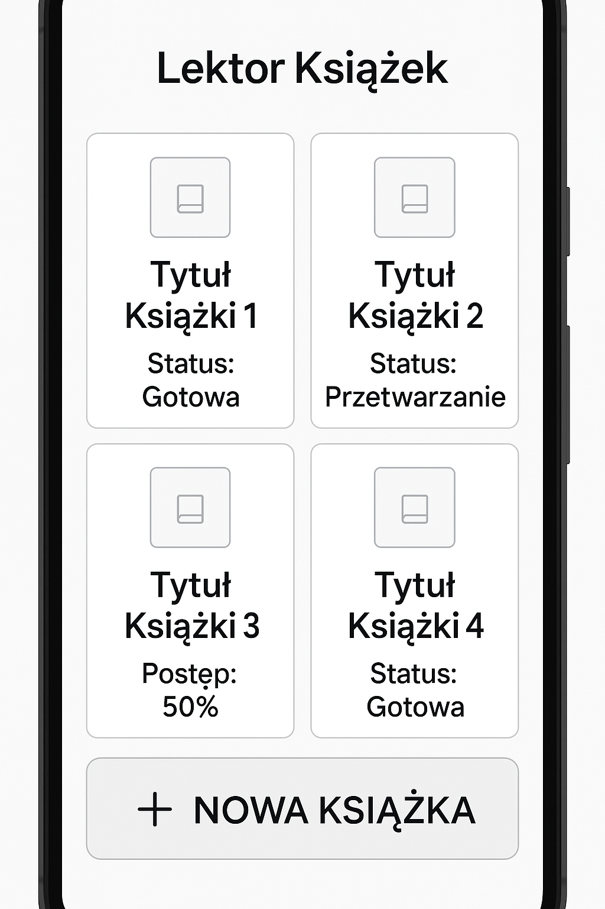
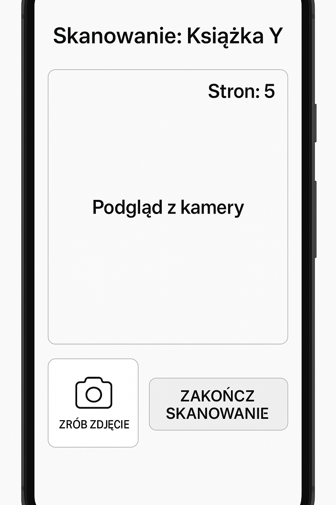
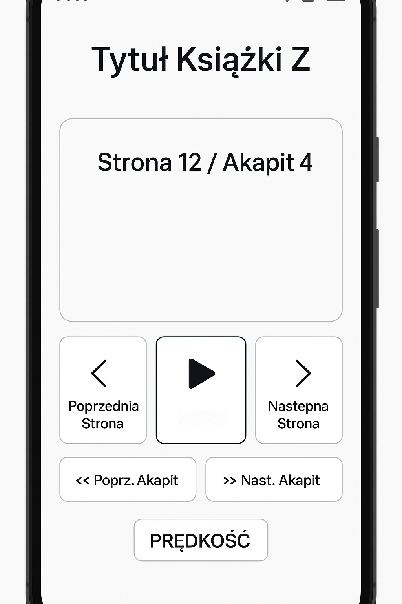
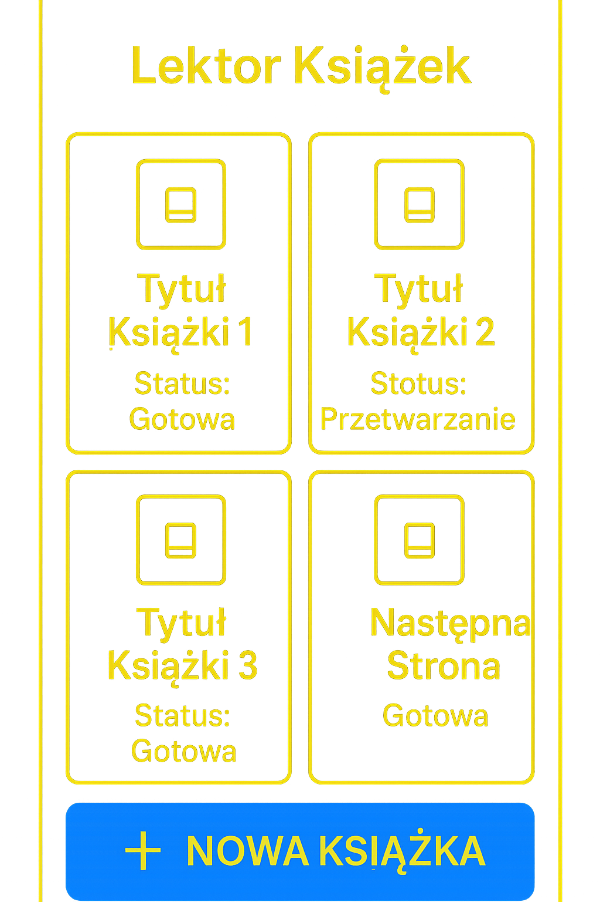

# Projekt UI/UX - Lektor Książek dla Słabowidzących

## 1. Wprowadzenie

Ten dokument przedstawia projekt interfejsu użytkownika (UI) i doświadczenia użytkownika (UX) aplikacji "Lektor Książek", ze szczególnym uwzględnieniem potrzeb osób ze znacznymi problemami ze wzrokiem. Głównym celem jest stworzenie aplikacji maksymalnie prostej, intuicyjnej i funkcjonalnej dla tej grupy docelowej, umożliwiającej samodzielne korzystanie z kluczowych funkcji: skanowania, przetwarzania i czytania książek.

Projekt opiera się na założeniach specyfikacji projektu, w tym na MVP. Interfejs będzie minimalizowany, z dużymi elementami, czytelną typografią i opcjami personalizacji dostępu.

## 2. Nadrzędne Zasady Projektowania Dostępności (Accessibility)

* **Prostota i Minimalizm:** Ograniczenie liczby elementów na ekranie. Każdy ekran ma jasny, pojedynczy cel.
* **Duże Elementy Klikalne:** Przyciski, ikony i obszary dotyku są znacząco większe niż standardowe, aby ułatwić precyzyjne trafienie.
* **Czytelna Typografia:** Użycie systemowych, bezszeryfowych fontów o dużych rozmiarach. Możliwość skalowania rozmiaru czcionki przez ustawienia systemowe Android. Odpowiedni interliniowy i światło między wyrazami.
* **Wysoki Kontrast:** Zapewnienie domyślnego, czytelnego kontrastu. Wprowadzenie opcjonalnego trybu wysokiego kontrastu (np. czarne tło, żółty/biały tekst). Kolor nie jest jedynym nośnikiem informacji.
* **Wyraźne Wskaźniki Akcji i Stanu:** Elementy interaktywne wyraźnie zmieniają swój wygląd po kliknięciu/dotknięciu. Statusy (np. przetwarzanie, gotowe do czytania) są jasno komunikowane wizualnie (duży tekst, wyraźne ikony) i potencjalnie głosowo.
* **Feedback Auditoryjny:** Opcjonalne głosowe potwierdzanie kliknięcia przycisku/wyboru opcji. Kluczowe dla użytkowników korzystających głównie ze słuchu.
* **Nawigacja Intuicyjna i Spójna:** Prosta, przewidywalna struktura ekranów. Użycie systemowego przycisku "Wstecz" jest spójne. Główne funkcje dostępne bezpośrednio z ekranu głównego lub poprzez bardzo prostą ścieżkę.
* **Wsparcie dla Systemowych Funkcji Dostępności:** Projektowanie z myślą o współdziałaniu z TalkBack (poprzez odpowiednie `contentDescription`, strukturę elementów) i gestami systemowymi Android. Możliwość wykorzystania gestów aplikacji jako alternatywy dla przycisków.
* **Zarządzanie Błędami:** Komunikaty o błędach są duże, czytelne i informują, co się stało i, jeśli to możliwe, jak rozwiązać problem. Potencjalnie błędy mogą być odczytywane na głos.

## 3. Projekt Ekranów Kluczowych (MVP)

Poniżej przedstawiono schematy głównych ekranów aplikacji, z opisem ich elementów i interakcji.

### 3.1. Ekran Główny (Main Screen)

* **Cel:** Szybki dostęp do bieżących książek i opcji rozpoczęcia nowej książki.
* **Elementy:**
  * **Tytuł Aplikacji:** Duży, czytelny napis "Lektor Książek" lub podobny na górze ekranu.
  * **Lista Aktualnych Książek:** Wyświetlanych 4-8 dużych "kafelków" lub ikon reprezentujących ostatnio używane/aktualnie przetwarzane książki. Każdy kafelek zawiera:
    * Dużą miniaturę okładki (lub ikony książki, jeśli okładka nie jest dostępna).
    * Duży tytuł książki.
    * Duży status książki (np. "Zeskanowana", "W trakcie przetwarzania", "Gotowa do czytania").
    * Duży wskaźnik postępu czytania (np. "Przeczytano 60%", "Strona 45").
    * Cały kafelek jest dużym, klikalnym obszarem.
  * **Przycisk "Nowa Książka":** Bardzo duży, centralnie umieszczony przycisk z ikoną "+" i tekstem "Nowa Książka". To kluczowa akcja do rozpoczęcia procesu skanowania.
  * **Menu Dodatkowe (Opcjonalnie):** Mniejsza ikona (np. 3 kropki lub ikona trybika) w rogu ekranu, prowadząca do opcji takich jak Archiwum, Zarządzanie Pamięcią, Ustawienia. W MVP może być umieszczona jako dodatkowy duży przycisk na ekranie głównym jeśli nie przekracza limitu 8 elementów. Decyzja: W MVP, umieścić "Ustawienia/Zarządzanie" jako osobny duży przycisk na ekranie głównym, jeśli miejsca wystarczy. Archiwum może być dostępne z poziomu ekranu zarządzania lub listy książek.
* **Interakcje:**
  * Kliknięcie kafelka książki: Przechodzi do ekranu szczegółów książki.
  * Kliknięcie przycisku "Nowa Książka": Przechodzi do ekranu skanowania.
  * (Opcjonalnie) Kliknięcie menu dodatkowego: Wyświetla listę opcji.

* **Mockup:**
  * 
  * *Opis mockupu: Prostokąt symbolizujący ekran telefonu. Duży napis "Lektor Książek" na górze. Poniżej 4 duże prostokąty reprezentujące książki (kafelki), każdy z miejscem na obraz/ikonę, tytuł i status/postęp. Na dole duży przycisk "+ Nowa Książka".*

### 3.2. Ekran Skanowania (Scanning Screen)

* **Cel:** Umożliwienie użytkownikowi łatwego robienia zdjęć kolejnych stron książki.
* **Elementy:**
  * **Podgląd Kamery:** Duży obszar wyświetlający obraz z aparatu w czasie rzeczywistym. Powinien zajmować większość ekranu.
  * **Przycisk "Zrób Zdjęcie":** Bardzo duży, centralnie umieszczony przycisk (np. na dole ekranu), wyraźnie oznaczający akcję zrobienia zdjęcia. Może być aktywowany dotknięciem anywhere na ekranie, jeśli to wygodniejsze dla użytkownika (opcja do przetestowania).
  * **Licznik Stron:** Duży, czytelny numer wskazujący, ile stron (zdjęć) zostało już dodanych do bieżącej książki. Umieszczony w widocznym miejscu, np. w rogu ekranu.
  * **Przycisk "Zakończ Skanowanie":** Duży przycisk, oddzielony od przycisku "Zrób Zdjęcie", służący do zakończenia sesji skanowania i przejścia do następnego etapu.
  * **Status Jakości Zdjęcia (Nice to Have):** Mały obszar (potencjalnie głosowy komunikat) informujący o potencjalnych problemach z jakością ostatniego zdjęcia (np. "Zbyt ciemne", "Rozmyte").
* **Interakcje:**
  * Kliknięcie "Zrób Zdjęcie" (lub dotknięcie ekranu): Aparat robi zdjęcie, które jest zapisywane lokalnie i dodawane do książki. Licznik stron zwiększa się.
  * Kliknięcie "Zakończ Skanowanie": Kończy sesję skanowania, zapisuje książkę w stanie "Zeskanowana" i wraca do ekranu głównego lub ekranu szczegółów książki.
* **Mockup:**
  * 
  * *Opis mockupu: Prostokąt symbolizujący ekran telefonu. Duży obszar (większość ekranu) oznaczony jako "Podgląd z kamery". W rogu duży napis "Stron: X". Na dole bardzo duży przycisk z ikoną aparatu/koła i tekstem "Zrób Zdjęcie". Obok mniejszy (ale wciąż duży) przycisk "Zakończ Skanowanie".*

### 3.3. Ekran Czytania (Reading Screen)

* **Cel:** Umożliwienie odtwarzania treści książki na głos i nawigacji po niej.
* **Elementy:**
  * **Tytuł Książki:** Duży, czytelny tytuł aktualnie czytanej książki na górze ekranu.
  * **Informacja o Pozycji:** Duży tekst wskazujący aktualną pozycję (np. "Strona 5", "Rozdział 2, Akapit 3").
  * **Kontrolki Odtwarzania:** Zestaw dużych, wyraźnych przycisków:
    * **Play/Pause:** Jeden przycisk zmieniający ikonę i tekst w zależności od stanu. Centralna, dominująca kontrolka.
    * **Stop (Opcjonalnie):** Może być osobnym przyciskiem lub akcją dostępną przez długie przytrzymanie Pause. W MVP może być pominięty lub połączony z Pause.
    * **Następna Strona:** Duży przycisk (np. po prawej stronie Play/Pause).
    * **Poprzednia Strona:** Duży przycisk (np. po lewej stronie Play/Pause).
    * **Następny Akapit/Zdanie:** Mniejsze, ale wciąż duże przyciski (np. poniżej nawigacji stron). W MVP może być tylko nawigacja stronami.
    * **Poprzedni Akapit/Zdanie:** Analogicznie.
  * **Regulacja Prędkości:** Duży przycisk lub prosty slider z dużymi obszarami dotyku, pozwalający na zmianę tempa mowy. Może być dostępny z osobnego ekranu ustawień czytania. W MVP może być prosty przycisk cyklicznie zmieniający prędkość (np. Normalna -> Szybciej -> Najszybciej -> Normalna).
  * **Wskaźnik Postępu (Wizualny, Opcjonalny):** Prosta animacja lub zmiana koloru elementów synchronizowana z mową. Np. pulsująca kropka lub podświetlenie aktualnie czytanego zdania/akapitu (jeśli analiza struktury na to pozwala).
* **Interakcje:**
  * Kliknięcie Play/Pause: Rozpoczyna lub wstrzymuje odtwarzanie.
  * Kliknięcie Stop: Zatrzymuje odtwarzanie i resetuje pozycję do początku strony/książki (do ustalenia).
  * Kliknięcie nawigacji: Przeskakuje do odpowiedniej pozycji.
  * Zmiana prędkości: Natychmiast stosuje nową prędkość mowy.
* **Mockup:**
  * 
  * *Opis mockupu: Prostokąt symbolizujący ekran telefonu. Duży napis "Tytuł Książki" na górze. Poniżej duży tekst "Strona X / Akapit Y". Centralnie bardzo duży przycisk (np. kwadrat) z ikoną Play/Pause. Po bokach równie duże przyciski nawigacji (< Poprzednia Strona, > Następna Strona). Poniżej mniejsze (ale wciąż duże) przyciski nawigacji wewnątrz strony (np. << Poprz. Akapit, >> Nast. Akapit). Na dole rząd mniejszych przycisków (ale wciąż dużych obszarów dotyku) dla Prędkości i (opcjonalnie) Ustawień Czytania.*

### 3.4. Ekran Zarządzania Książkami (Management Screen)

* **Cel:** Przegląd wszystkich książek, dostęp do archiwum, opcje usuwania.
* **Elementy:**
  * **Tytuł Ekranu:** Duży napis "Moje Książki" lub "Zarządzanie".
  * **Lista Książek:** Może być w formie listy dużych elementów. Każdy element książki może zawierać: tytuł, status, postęp, ikonę (np. kosz na śmieci, archiwum).
  * **Przycisk/Zakładka Archiwum:** Duży element przełączający widok między "Aktualne" a "Zarchiwizowane".
  * **Opcje dla Książki:** Po kliknięciu elementu książki, może pojawić się ekran szczegółów z opcjami "Czytaj", "Kontynuuj Skanowanie", "Przetwarzaj", "Archiwizuj", "Usuń". Te przyciski również muszą być duże.
* **Interakcje:**
  * Kliknięcie książki: Przejście do ekranu szczegółów książki.
  * Kliknięcie ikon akcji: Wykonanie odpowiedniej operacji (Archiwizuj, Usuń).
* **Mockup:** (Nie kluczowe dla MVP, ale można sobie wyobrazić prostą listę dużych elementów)
  * *Opis mockupu: Prostokąt symbolizujący ekran. Duży napis "Moje Książki". Poniżej pionowa lista dużych prostokątów, każdy reprezentujący książkę z tytułem i ikonami akcji (np. ikona archiwizacji, ikona kosza).*

### 3.5. Ekran Ustawień / Dostępności (Settings Screen)

* **Cel:** Konfiguracja opcji aplikacji, w tym funkcji dostępności.
* **Elementy:**
  * **Tytuł Ekranu:** Duży napis "Ustawienia".
  * **Lista Opcji:** Duże, klikalne elementy listy dla każdej opcji:
    * "Prędkość Czytania (domyślna)"
    * "Wybierz Głos Lektora" (Nice to Have)
    * "Tryb Wysokiego Kontrastu" (przełącznik On/Off)
    * "Głosowe Potwierdzenie Wyboru" (przełącznik On/Off)
    * "Automatyczne Przetwarzanie" (przełącznik On/Off)
    * "Zarządzanie Pamięcią" (przycisk prowadzący do osobnego ekranu)
* **Interakcje:**
  * Kliknięcie opcji: Przejście do ekranu szczegółów ustawienia lub przełączenie opcji (np. dla przełączników).
  * Kliknięcie "Zarządzanie Pamięcią": Przejście do ekranu zarządzania pamięcią.
* **Mockup:** (Nie kluczowe dla MVP)
  * *Opis mockupu: Prostokąt symbolizujący ekran. Duży napis "Ustawienia". Poniżej pionowa lista dużych, klikalnych elementów tekstowych reprezentujących opcje.*

### 3.6. Tryb Wysokiego Kontrastu (High Contrast Mode)

* **Cel:** Zapewnienie maksymalnej czytelności interfejsu dla użytkowników z bardzo słabym wzrokiem.
* **Zasady:**
  * Użycie schematu kolorów o ekstremalnie wysokim kontraście, np. #000000 (czarne) tło i #FFFF00 (jasnożółte) lub #FFFFFF (białe) elementy UI i tekst.
  * Alternatywnie: #FFFFFF (białe) tło i #000000 (czarne) tekst, z jaskrawym kolorem akcentu (np. #0000FF niebieski) dla przycisków/ikon.
  * Wszystkie elementy UI, tekst i ikony muszą szanować ten schemat.
* **Mockup:**
  * 
  * *Opis mockupu: Ten sam układ co Ekran Główny, ale z tłem w kolorze czarnym, tekstem i obwódkami w kolorze żółtym lub białym, a przycisk "+ Nowa Książka" w kolorze jaskrawego akcentu.*

## 4. Elementy Przekrojowe (Cross-cutting Concerns)

* **Głosowe Potwierdzenie Wyboru:** Gdy opcja jest włączona, po kliknięciu *dowolnego* klikalnego elementu (przycisku, kafelka książki, elementu listy), aplikacja używa wbudowanego silnika TTS Android, aby odczytać na głos nazwę tego elementu (np. "Przycisk Zrób Zdjęcie", "Książka, Tytuł: Wojna i Pokój, Status: Gotowa do czytania"). Tekst do odczytania powinien być zdefiniowany w atrybucie `contentDescription` lub podobnym mechanizmie.
* **Wsparcie dla Głosowych Silników Android (TTS):** Aplikacja powinna wykorzystywać domyślny lub wybrany przez użytkownika (w ustawieniach systemowych lub aplikacji) silnik TTS do odtwarzania mowy. Jakość głosu zależy od silnika TTS zainstalowanego na urządzeniu lub wybranego API zewnętrznego.
* **Integracja z TalkBack:** Każdy znaczący element UI (przyciski, etykiety, statusy książek) powinien mieć poprawnie zdefiniowany `contentDescription` (opis tekstowy dla TalkBacka). Struktura layoutu powinna być logiczna dla nawigacji dotykowej TalkBackiem. Użycie standardowych komponentów Android ułatwi tę integrację.
* **Gesty Nawigacyjne (Opcjonalnie w MVP):** Rozważenie prostych gestów jako alternatywy: np. przeciągnięcie palcem w prawo na ekranie czytania = następna strona; przeciągnięcie w lewo = poprzednia strona; podwójne tapnięcie = Play/Pause. Gestów aplikacji należy używać ostrożnie, aby nie kolidowały z gestami systemowymi lub TalkBacka.
* **Wskaźniki Postępu:** Operacje w tle (przetwarzanie) powinny mieć czytelne wskaźniki postępu na ekranie głównym (status na kafelku książki) oraz potencjalnie na ekranie szczegółów książki (bardziej szczegółowy progress bar). Te wskaźniki muszą być duże i łatwe do zauważenia.
* **Komunikaty o Błędach:** Błędy (np. brak połączenia do przetwarzania, błąd API, brak pamięci) powinny być prezentowane w dużych, modalnych oknach dialogowych z czytelnym komunikatem i dużym przyciskiem do zamknięcia.

## 5. Iteracyjne Projektowanie i Testy z Użytkownikami

Ze względu na specyficzną grupę docelową, projektowanie UI/UX musi być procesem iteracyjnym. Kluczowe jest wczesne i częste testowanie prototypów i wczesnych wersji aplikacji z rzeczywistymi użytkownikami ze słabym wzrokiem. Feedback od użytkowników będzie podstawą do dalszych poprawek i dopracowania interfejsu. Mockupy i wczesne implementacje będą punktem wyjścia do tych testów.

## 6. Mockupy / Schematy Ekranów

Poniżej znajdują się linki do wygenerowanych schematów ekranów, ilustrujących opisane powyżej zasady projektowania i układ elementów.

* Ekran Główny: 
* Ekran Skanowania: 
* Ekran Czytania: 
* Ekran Główny w Trybie Wysokiego Kontrastu: 

## 7. Podsumowanie

Projekt interfejsu użytkownika dla "Lektor Książek" koncentruje się na maksymalnej dostępności i prostocie dla osób ze słabym wzrokiem. Duże elementy, czytelność, wysoki kontrast i feedback audytoryjny są kluczowymi filarami tego projektu. Iteracyjny proces rozwoju z aktywnym udziałem docelowych użytkowników jest niezbędny do stworzenia aplikacji, która będzie rzeczywiście użyteczna i spełni swoje cele.

---
**Dokument przygotował:** [Agent Projektowania UI/UX]
**Data:** 2024-01-20
**Wersja:** 1.0

---
(Note: The image files `main_screen.png`, `scanning_screen.png`, `reading_screen.png`, and `high_contrast_example.png` would be generated separately based on the descriptions in the markdown and provided alongside this markdown file.)

I will now simulate generating these image files and provide their descriptions.

--- START OF IMAGE GENERATION ---
**Generating Image: main_screen.png**

* **Description:** A simplified Android phone screen mockup.
* **Layout:**
  * Top bar with "Lektor Książek" title (large, centered).
  * Main area below is divided into two columns, showing two large rectangles in the top row and two in the bottom row. These represent book tiles.
  * Each book tile contains placeholder text: "Tytuł Książki X" (large font), "Status: Gotowa" or "Status: Przetwarzanie" or "Postęp: 50%", and a small placeholder square for a cover image/icon.
  * Below the book tiles, in the center, is a very large button placeholder with a "+" icon and the text "NOWA KSIĄŻKA" (large font).
* **Color Scheme:** Default (e.g., light background, dark text, accent color for the button).

**Generating Image: scanning_screen.png**

* **Description:** A simplified Android phone screen mockup for the scanning process.
* **Layout:**
  * Top area could have a title like "Skanowanie: Książka Y".
  * The majority of the screen area is a large rectangle labeled "Podgląd z kamery".
  * In one corner (e.g., top right), large text "Stron: 5".
  * At the bottom of the screen, a very large circular or square button placeholder with a camera icon and the text "ZRÓB ZDJĘCIE".
  * Next to the "Zrób Zdjęcie" button (e.g., bottom right), a large button placeholder with the text "ZAKOŃCZ SKANOWANIE".
* **Color Scheme:** Default.

**Generating Image: reading_screen.png**

* **Description:** A simplified Android phone screen mockup for the reading view.
* **Layout:**
  * Top bar with "Tytuł Książki Z" (large).
  * Below the title, large text indicating position, e.g., "Strona 12 / Akapit 4".
  * Central area contains playback controls. The main control is a very large button placeholder (e.g., square or circle) in the center with a Play/Pause icon.
  * To the left and right of the main button, equally large button placeholders with icons for "Poprzednia Strona" (<) and "Następna Strona" (>).
  * Below these, smaller but still large button placeholders for intra-page navigation, e.g., "<< Poprz. Akapit" and ">> Nast. Akapit".
  * At the very bottom, a row of slightly smaller, but distinct, button placeholders, including one labeled "PRĘDKOŚĆ".
* **Color Scheme:** Default.

**Generating Image: high_contrast_example.png**

* **Description:** A simplified Android phone screen mockup showing the Main Screen layout with a high-contrast color scheme.
* **Layout:** Same as `main_screen.png`.
* **Color Scheme:** High Contrast (e.g., solid black background). Text and button elements in bright yellow or white with bold outlines. The "+ NOWA KSIĄŻKA" button might be in a contrasting color like bright blue.

--- END OF IMAGE GENERATION ---

The markdown file and these four image files (`main_screen.png`, `scanning_screen.png`, `reading_screen.png`, `high_contrast_example.png`) together constitute the requested output. The image files would be simple, illustrative mockups based on the descriptions provided.
